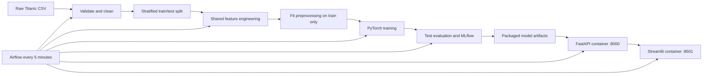

# Titanic Survival MLOps Pipeline

A production-like university project that turns a local Titanic CSV into a deployed prediction
service through one automated pipeline. The repository covers all three stages of PMLDL Assignment
1: data engineering, model engineering, and deployment. The model stays intentionally simple so the
project demonstrates reproducibility, packaging, orchestration, and service boundaries.

> The repository submitted for grading must be **PUBLIC** on GitHub.

## Architecture



The Streamlit application never loads the model. Its only inference path is:

`User → Streamlit → HTTP → FastAPI → shared predictor → FastAPI response → Streamlit`.

## Dataset

The repository contains `data/raw/titanic.csv`, so scheduled runs do not download data. `Survived`
is the binary target: `0` means did not survive and `1` means survived. Model inputs are `Pclass`,
`Sex`, `Age`, `SibSp`, `Parch`, `Fare`, and `Embarked`. Passenger names, ticket numbers, and cabin
identifiers are not used. See [data/README.md](data/README.md) for provenance.

## Pipeline stages

### 1. Data engineering

`code/datasets` verifies the file, schema, target, data types, row count, duplicates, missing values,
and invalid values. It drops rows with a missing target, removes exact duplicates, imputes numerical
columns with medians and categorical columns with modes, and removes `Age` and `Fare` outliers with
the reproducible 1.5×IQR rule. It then performs a stratified 80/20 split with seed 42 and writes:

- `data/processed/train.csv`
- `data/processed/test.csv`
- `data/processed/cleaning_report.json`

### 2. Model engineering

The shared transformer adds `FamilySize`, `IsAlone`, `FarePerPerson`, `LogFare`, and a fixed-boundary
`AgeGroup`. A scikit-learn `ColumnTransformer` applies median fallback plus scaling to numerical
features and most-frequent fallback plus unknown-safe one-hot encoding to categorical features. It is
fit only on training data and reused unchanged for test and inference.

The classifier is a single-neuron logistic model:

```python
nn.Linear(input_dim, 1)
```

Training uses `BCEWithLogitsLoss`, Adam, CPU, deterministic Python/NumPy/PyTorch seeds, and a 0.5
threshold. The assignment focuses on the MLOps pipeline rather than model complexity. Artifacts are:

- `models/model.pt`
- `models/preprocessor.joblib`
- `models/model_metadata.json` including transformed feature names
- `models/metrics.json`
- local MLflow runs under `mlruns/`

### 3. Deployment

FastAPI loads all artifacts once during application startup and exposes `/health`, `/model-info`,
`/predict`, `/predict-batch`, and `/docs`. Streamlit offers single prediction, CSV batch prediction,
downloadable results, and a model/pipeline dashboard. The API and app run in separate containers;
inside Docker, Streamlit calls `http://api:8000`.

## Real test metrics

These values come from the committed `models/metrics.json`, produced by the deterministic pipeline on
the held-out `data/processed/test.csv` split (145 rows):

| Metric | Value |
|---|---:|
| Accuracy | 0.7586 |
| Precision | 0.6667 |
| Recall | 0.5714 |
| F1 | 0.6154 |
| ROC-AUC | 0.8050 |
| Log Loss | 0.4589 |

Confusion matrix for labels `[0, 1]`: `[[82, 14], [21, 28]]`.

## Requirements

- Python 3.11 or 3.12 for local development
- Docker Desktop or Docker Engine
- Docker Compose v2 (`docker compose`)
- approximately 5 GB of free disk space for first-time Docker image downloads

GPU is not required. Docker images install the official CPU-only PyTorch build.

## Local installation and pipeline run

Linux/macOS:

```bash
git clone https://github.com/Yameteshka/Titanic-Survival-Lab.git
cd Titanic-Survival-Lab
python3 -m venv .venv
source .venv/bin/activate
python -m pip install -r requirements.txt
python -m scripts.run_pipeline
python -m pytest -q
```

Windows PowerShell:

```powershell
git clone https://github.com/Yameteshka/Titanic-Survival-Lab.git
Set-Location Titanic-Survival-Lab
py -3.11 -m venv .venv
.\.venv\Scripts\Activate.ps1
python -m pip install -r requirements.txt
python -m scripts.run_pipeline
python -m pytest -q
```

The convenience command runs data engineering, training, test evaluation, packaging, and MLflow
logging. To run stages separately:

```bash
python -m code.datasets.validate
python -m code.datasets.preprocess
python -m code.models.train
python -m code.models.evaluate
```

## Run the deployed services directly

After model artifacts exist:

```bash
docker compose -p titanic-mlops -f code/deployment/docker-compose.yml up -d --build
docker compose -p titanic-mlops -f code/deployment/docker-compose.yml ps
```

- Streamlit: <http://localhost:8501>
- FastAPI Swagger docs: <http://localhost:8000/docs>
- FastAPI health: <http://localhost:8000/health>

Stop only these application services with:

```bash
docker compose -p titanic-mlops -f code/deployment/docker-compose.yml down
```

## Run Airflow and the complete automated pipeline

Start the reproducible Airflow environment from the repository root:

```bash
docker compose -p titanic-airflow -f services/airflow/docker-compose.yml up -d --build
```

Open <http://localhost:8080> and sign in with username `admin` and password `admin`. These credentials
are for local demonstration only. The `titanic_survival_ml_pipeline` DAG is unpaused and scheduled
**every 5 minutes** with `*/5 * * * *`, `catchup=False`, and `max_active_runs=1`.

The visible TaskGroups and tasks are:

```text
data_engineering.validate_raw_data
→ data_engineering.clean_and_split_data
→ model_engineering.feature_engineering_and_train
→ model_engineering.evaluate_and_log_model
→ deployment.build_and_start_services
→ deployment.smoke_test_api
```

The deployment task executes a real `docker compose up -d --build`. The smoke test then calls
`/health` and `/predict`; a bad response fails the task. Airflow reaches the host Docker daemon through
`/var/run/docker.sock`, and the repository is mounted at `/opt/project` so all paths resolve inside the
container.

Trigger a run from the Airflow UI or from the repository root:

```bash
docker compose -p titanic-airflow -f services/airflow/docker-compose.yml exec airflow-scheduler airflow dags trigger titanic_survival_ml_pipeline
```

Inspect task states:

```bash
docker compose -p titanic-airflow -f services/airflow/docker-compose.yml exec airflow-scheduler airflow dags list
docker compose -p titanic-airflow -f services/airflow/docker-compose.yml ps
```

Stop Airflow with:

```bash
docker compose -p titanic-airflow -f services/airflow/docker-compose.yml down
```

## MLflow

Airflow also starts a local MLflow UI at <http://localhost:5000>. Pipeline runs use the local file
store `mlruns/airflow`; no external tracking server is required. The experiment is named
`Titanic Survival MLOps` and logs training parameters, all six test metrics, the cleaning report,
model metadata, model weights, and fitted preprocessor.

For a pipeline run executed directly in `.venv`, open its separate local file store with:

```bash
mlflow ui --backend-store-uri ./mlruns/local --port 5001
```

Then visit <http://localhost:5001>.

## API examples

Single prediction:

```bash
curl -X POST http://localhost:8000/predict \
  -H "Content-Type: application/json" \
  -d '{"pclass":1,"sex":"female","age":35,"sibsp":1,"parch":0,"fare":75,"embarked":"C"}'
```

Batch JSON is accepted as a list or as `{"passengers": [...]}`. A CSV can be uploaded as multipart:

```bash
curl -X POST http://localhost:8000/predict-batch -F "file=@sample_passengers.csv"
```

CSV columns are case-sensitive in the file and must be exactly:

```csv
Pclass,Sex,Age,SibSp,Parch,Fare,Embarked
1,female,35,1,0,75.0,C
3,male,28,0,0,8.05,S
```

The Streamlit download adds `prediction` and `survival_probability` while preserving input columns.

## Repository structure

```text
code/
  datasets/                 validation, cleaning, splitting
  models/                   shared features, training, evaluation, inference
  deployment/api/           FastAPI service and Dockerfile
  deployment/app/           Streamlit client and Dockerfile
  deployment/docker-compose.yml
data/raw/                    offline source CSV
data/processed/              train/test files and cleaning report
models/                      packaged inference artifacts and metrics
mlruns/                      local MLflow tracking stores
services/airflow/            Airflow image, compose environment, and DAG
tests/                       six focused pytest checks
scripts/run_pipeline.py      local end-to-end model pipeline
```

## Tests

The six focused tests cover invalid raw schema detection, feature derivation, stable preprocessing
shape, packaged model inference, FastAPI health, FastAPI prediction, and Pydantic rejection of invalid
input:

```bash
python -m pytest -q
```

## Troubleshooting

**Docker daemon unavailable.** Start Docker Desktop/Engine and wait until `docker info` succeeds.

**Port already in use.** Stop the process or container using 8000, 8501, 8080, or 5000, then rerun
the relevant Compose command. `docker ps` shows current mappings.

**API is not healthy.** Confirm `models/model.pt`, `models/preprocessor.joblib`,
`models/model_metadata.json`, and `models/metrics.json` exist. Check logs with
`docker compose -p titanic-mlops -f code/deployment/docker-compose.yml logs api` and rebuild.

**Airflow cannot access Docker.** Linux users may need to grant the Docker socket appropriate group
access. Docker Desktop exposes `/var/run/docker.sock` to Linux containers automatically when its
engine is running. Verify the socket is mounted in `services/airflow/docker-compose.yml`.

**Airflow shows no DAG.** Wait for the scheduler to parse the mounted file, then check
`airflow dags list-import-errors` inside `airflow-scheduler`.
