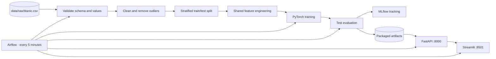

# Titanic Survival MLOps Pipeline

An end-to-end MLOps project for binary survival prediction on the Titanic dataset. A scheduled
Airflow DAG validates and prepares the data, trains a deterministic PyTorch classifier, evaluates it
on a held-out test set, records the run in MLflow, and redeploys the API and web application as two
independent Docker services.

The model is intentionally compact: one `nn.Linear(input_dim, 1)` output neuron. The project focuses
on reproducible data processing, artifact packaging, orchestration, and reliable inference rather
than model complexity.

## System overview



The web application has no direct access to the model:

```text
User → Streamlit → HTTP request → FastAPI → shared predictor → HTTP response → Streamlit
```

## Services

| Service | URL | Purpose |
|---|---|---|
| Streamlit | <http://localhost:8501> | Single and batch predictions |
| FastAPI | <http://localhost:8000/docs> | Interactive API documentation |
| Airflow | <http://localhost:8080> | DAG monitoring and manual runs |
| MLflow | <http://localhost:5000> | Parameters, test metrics, and artifacts |

Airflow credentials for the local environment are `admin` / `admin`.

## Dataset

The repository includes `data/raw/titanic.csv`; scheduled runs never depend on an external download.
The file is the public Titanic training dataset distributed by Data Science Dojo and contains 891
passenger records. Full provenance is recorded in [`data/README.md`](data/README.md).

`Survived` is the binary target: `0` means the passenger did not survive and `1` means the passenger
survived. The model uses `Pclass`, `Sex`, `Age`, `SibSp`, `Parch`, `Fare`, and `Embarked`. Names,
tickets, cabins, and other passenger identifiers are excluded from model inputs.

## Repository layout

```text
.
├── code/
│   ├── datasets/                 # validation, cleaning, and splitting
│   ├── models/                   # features, training, evaluation, inference
│   └── deployment/
│       ├── api/                  # FastAPI service and Dockerfile
│       ├── app/                  # Streamlit client and Dockerfile
│       └── docker-compose.yml
├── data/
│   ├── raw/titanic.csv           # offline source dataset
│   └── processed/                # train/test data and cleaning report
├── models/                       # model, preprocessor, metadata, metrics
├── mlruns/                       # local MLflow stores
├── services/airflow/             # Airflow image, compose stack, and DAG
├── scripts/run_pipeline.py       # local data/model pipeline entry point
├── tests/                        # focused pytest suite
└── requirements.txt
```

## Requirements

- Python 3.11 or 3.12
- Docker Desktop or Docker Engine
- Docker Compose v2 (`docker compose`)
- Approximately 5 GB of free disk space for the initial image build

All training and inference code runs on CPU. A GPU is not required.

## Quick start

### 1. Clone and prepare the Python environment

Windows PowerShell:

```powershell
git clone https://github.com/Yameteshka/Titanic-Survival-Lab.git
Set-Location Titanic-Survival-Lab
py -3.11 -m venv .venv
.\.venv\Scripts\Activate.ps1
python -m pip install --upgrade pip
python -m pip install -r requirements.txt
```

Linux or macOS:

```bash
git clone https://github.com/Yameteshka/Titanic-Survival-Lab.git
cd Titanic-Survival-Lab
python3.11 -m venv .venv
source .venv/bin/activate
python -m pip install --upgrade pip
python -m pip install -r requirements.txt
```

### 2. Run the local pipeline and tests

```bash
python -m scripts.run_pipeline
python -m pytest -q
```

The pipeline writes the processed datasets, trained model, fitted preprocessor, metadata, metrics,
and a local MLflow run. Each stage can also be executed separately:

```bash
python -m code.datasets.validate
python -m code.datasets.preprocess
python -m code.models.train
python -m code.models.evaluate
```

### 3. Start the prediction services

```bash
docker compose -p titanic-mlops -f code/deployment/docker-compose.yml up -d --build
docker compose -p titanic-mlops -f code/deployment/docker-compose.yml ps
```

The expected result is one healthy API container on port `8000` and one Streamlit container on port
`8501`. Inside the Docker network, Streamlit reaches FastAPI at `http://api:8000`.

To stop the prediction services:

```bash
docker compose -p titanic-mlops -f code/deployment/docker-compose.yml down
```

## Automated pipeline with Airflow

Start the orchestration stack from the repository root:

```bash
docker compose -p titanic-airflow -f services/airflow/docker-compose.yml up -d --build
```

The `titanic_survival_ml_pipeline` DAG is enabled automatically and runs **every 5 minutes**:

```text
Schedule:        */5 * * * *
Catchup:         false
Max active runs: 1
```

Its TaskGroups and execution order are:

```text
data_engineering.validate_raw_data
  → data_engineering.clean_and_split_data
  → model_engineering.feature_engineering_and_train
  → model_engineering.evaluate_and_log_model
  → deployment.build_and_start_services
  → deployment.smoke_test_api
```

The deployment task executes `docker compose up -d --build`, so the API image always contains the
latest packaged model. The smoke test waits for `/health`, submits one request to `/predict`, and
fails the Airflow task if either check fails.

Trigger an additional run from the Airflow UI or with:

```bash
docker compose -p titanic-airflow -f services/airflow/docker-compose.yml exec \
  airflow-scheduler airflow dags trigger titanic_survival_ml_pipeline
```

Inspect the environment:

```bash
docker compose -p titanic-airflow -f services/airflow/docker-compose.yml ps
docker compose -p titanic-airflow -f services/airflow/docker-compose.yml exec \
  airflow-scheduler airflow dags list-runs -d titanic_survival_ml_pipeline --no-backfill
```

Airflow uses the host Docker daemon through `/var/run/docker.sock`. The repository is mounted at
`/opt/project`, which is the project root used by every DAG task.

To stop the orchestration stack:

```bash
docker compose -p titanic-airflow -f services/airflow/docker-compose.yml down
```

## Pipeline stages

### Data engineering

Input: `data/raw/titanic.csv`

The validation step checks:

- required columns and minimum row count;
- binary values in `Survived`;
- numeric feature types;
- missing values and exact duplicates;
- valid ranges for `Age`, `Fare`, `SibSp`, `Parch`, and `Pclass`;
- allowed categories for `Sex` and `Embarked`.

Rows with a missing target are removed. Numerical gaps are filled with the column median and
categorical gaps with the most frequent value. Exact duplicate rows are removed. Extreme `Age` and
`Fare` observations are filtered with fixed, reproducible 1.5×IQR bounds calculated during the
cleaning run.

The cleaned data is split with `test_size=0.2`, `random_state=42`, and stratification by `Survived`.
Outputs:

- `data/processed/train.csv`
- `data/processed/test.csv`
- `data/processed/cleaning_report.json`

The cleaning report records source row count, missing values, imputation values, duplicate removals,
IQR bounds, outlier removals, final row count, and split sizes.

### Model engineering

One reusable transformer produces the derived features used during training, evaluation, API
inference, and batch inference:

| Feature | Definition |
|---|---|
| `FamilySize` | `SibSp + Parch + 1` |
| `IsAlone` | `1` when `FamilySize == 1`, otherwise `0` |
| `FarePerPerson` | `Fare / FamilySize`, with zero-division protection |
| `LogFare` | `log1p(Fare)` |
| `AgeGroup` | Fixed child, teenager, young adult, adult, and senior ranges |

The scikit-learn preprocessing pipeline applies median fallback imputation and `StandardScaler` to
numeric features. Categorical features use most-frequent fallback imputation and
`OneHotEncoder(handle_unknown="ignore")`. The preprocessor is fit only on `train.csv`; `test.csv` is
transformed without refitting.

Training is deterministic with seed `42` for Python, NumPy, and PyTorch:

```python
model = nn.Linear(input_dim, 1)
loss = nn.BCEWithLogitsLoss()
optimizer = torch.optim.Adam(model.parameters(), lr=0.01)
```

Inference applies `sigmoid(logit)` and a classification threshold of `0.5`.

Packaged artifacts:

| Artifact | Contents |
|---|---|
| `models/model.pt` | State dictionary and model input dimension |
| `models/preprocessor.joblib` | Fitted feature and preprocessing pipeline |
| `models/model_metadata.json` | Version, timestamp, feature names, data sizes, seed, and dependencies |
| `models/metrics.json` | Metrics calculated on the held-out test set |

### Evaluation and MLflow

Evaluation uses only `data/processed/test.csv`. The committed metrics were produced by an actual
deterministic run over 145 test rows:

| Metric | Value |
|---|---:|
| Accuracy | 0.7586 |
| Precision | 0.6667 |
| Recall | 0.5714 |
| F1 | 0.6154 |
| ROC-AUC | 0.8050 |
| Log Loss | 0.4589 |

Confusion matrix for labels `[0, 1]`: `[[82, 14], [21, 28]]`.

The MLflow experiment is named `Titanic Survival MLOps`. Each run records:

- parameters: epochs, learning rate, optimizer, model type, threshold, data sizes, and seed;
- metrics: accuracy, precision, recall, F1, ROC-AUC, and log loss;
- artifacts: model, preprocessor, model metadata, test metrics, and cleaning report.

Airflow exposes the file-backed MLflow UI at <http://localhost:5000>. Runs executed directly from the
virtual environment use `mlruns/local` and can be inspected separately:

```bash
mlflow ui --backend-store-uri ./mlruns/local --port 5001
```

### Deployment

The packaged artifacts are served by FastAPI and consumed over HTTP by Streamlit. Each service has
its own Dockerfile, container, port, and healthcheck. The application Compose file contains no source
or model bind mounts; rebuilding the API image packages the current model artifacts into the image.
The Airflow deployment TaskGroup performs that rebuild automatically after every successful model
evaluation and verifies the new API with a smoke test.

## API

FastAPI loads the model, fitted preprocessor, metadata, and test metrics once during application
startup.

| Method | Endpoint | Description |
|---|---|---|
| `GET` | `/health` | Service status, model load state, version, and training timestamp |
| `GET` | `/model-info` | Model details, features, data sizes, and test metrics |
| `POST` | `/predict` | Validate and score one passenger |
| `POST` | `/predict-batch` | Validate and score JSON records or a CSV upload |
| `GET` | `/docs` | Swagger UI |

Single prediction example:

```bash
curl -X POST http://localhost:8000/predict \
  -H "Content-Type: application/json" \
  -d '{"pclass":1,"sex":"female","age":35,"sibsp":1,"parch":0,"fare":75,"embarked":"C"}'
```

Batch JSON may be a list of records or an object with a `passengers` list. CSV upload example:

```bash
curl -X POST http://localhost:8000/predict-batch \
  -F "file=@sample_passengers.csv"
```

Pydantic restricts class to `1`, `2`, or `3`; sex to `male` or `female`; embarkation to `C`, `Q`, or
`S`; age to `0–120`; fare to a non-negative value; and family counts to non-negative integers.

## Streamlit application

The web interface contains three sections:

- **Single prediction** — input controls, example profiles, derived-feature preview, prediction
  button, survival probabilities, confidence visualization, submitted values, and model version.
- **Batch prediction** — required-column reference, sample CSV download, drag-and-drop upload, data
  preview, row-level validation, result preview, and downloadable `predictions.csv`.
- **Model & Pipeline** — API status, model details, training timestamp, test metrics, split sizes, and
  the deployed pipeline diagram.

Required CSV columns:

```csv
Pclass,Sex,Age,SibSp,Parch,Fare,Embarked
1,female,35,1,0,75.0,C
3,male,28,0,0,8.05,S
```

The downloaded file preserves the source columns and appends `prediction` and
`survival_probability`.

## Verification

Run the focused test suite:

```bash
python -m pytest -q
```

The tests cover raw-data validation, derived features, preprocessing output shape, packaged-model
inference, API health, successful single prediction, and invalid-input rejection.

Operational checks:

```bash
curl --fail http://localhost:8000/health
curl --fail http://localhost:8501/_stcore/health
docker compose -p titanic-mlops -f code/deployment/docker-compose.yml ps
docker compose -p titanic-airflow -f services/airflow/docker-compose.yml ps
```

## Troubleshooting

| Problem | Resolution |
|---|---|
| Docker daemon is unavailable | Start Docker Desktop or Docker Engine and wait until `docker info` succeeds. |
| Port 8000, 8501, 8080, or 5000 is busy | Stop the process using the port, then restart the corresponding Compose stack. |
| API health check fails | Confirm all four files under `models/` exist, inspect API logs, and rebuild the application stack. |
| Airflow cannot start application containers | Confirm `/var/run/docker.sock` is mounted and accessible to the Airflow containers. |
| DAG is not visible | Wait for scheduler parsing, then run `airflow dags list-import-errors` inside `airflow-scheduler`. |
| Streamlit reports that the API is offline | Check the `api` container health and verify `API_URL=http://api:8000` in the Compose configuration. |

API logs:

```bash
docker compose -p titanic-mlops -f code/deployment/docker-compose.yml logs api
```

Airflow import diagnostics:

```bash
docker compose -p titanic-airflow -f services/airflow/docker-compose.yml exec \
  airflow-scheduler airflow dags list-import-errors
```
